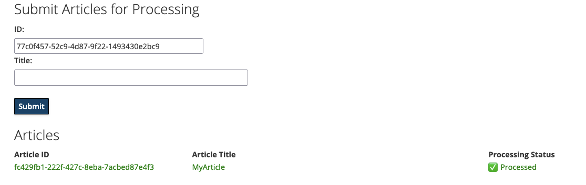
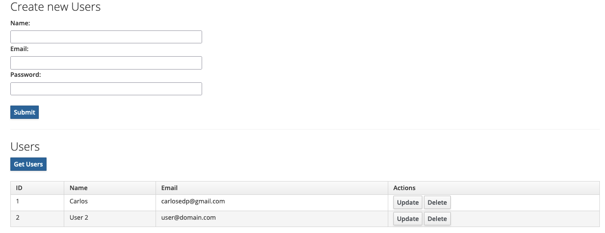

# scala3-quarkus-quickstart

[](https://github.com/carlosedp/scala3-quarkus-quickstart/actions/workflows/CI.yaml)
[](https://sonarcloud.io/summary/new_code?id=carlosedp_scala3-quarkus-quickstart)
[](https://codecov.io/gh/carlosedp/scala3-quarkus-quickstart)

This project is quickstart using Scala 3 and Quarkus, the Supersonic Subatomic Java Framework.

If you want to learn more about Quarkus, please visit its website: <https://quarkus.io/>.

To learn more about Scala and new in [Scala 3](https://docs.scala-lang.org/scala3/book/introduction.html), check-out <https://docs.scala-lang.org/scala3/new-in-scala3.html>.

## Development tools recommendation

To start developing in Quarkus/Scala 3, I recommend the following:

- [Coursier](https://get-coursier.io/) to manage Scala tools and JVM install
- GraalVM 21 installed thru Coursier
- Install scalafmt and scalafix thru Coursier
- [Quarkus CLI](https://quarkus.io/get-started/)
- [VSCode](https://code.visualstudio.com/) as IDE
- The following VSCode Extensions
  - [Metals](https://marketplace.visualstudio.com/items?itemName=scalameta.metals) by ScalaMeta
  - [Scala Syntax](https://marketplace.visualstudio.com/items?itemName=scala-lang.scala)
  - [Scaladex search](https://marketplace.visualstudio.com/items?itemName=baccata.scaladex-search)
  - [Quarkus Tools](https://marketplace.visualstudio.com/items?itemName=redhat.vscode-quarkus)

The repository also comes with a [Github Action](https://github.com/carlosedp/scala3-quarkus-quickstart/actions/workflows/CI.yaml) that runs tests on PRs and pushes.

This repository demonstrates multiple Quarkus concepts, as:

- Application [Config](https://quarkus.io/guides/config) as in [GreetingResource.scala](https://github.com/carlosedp/scala3-quarkus-quickstart/blob/main/src/main/scala/org/acme/GreetingResource.scala)
- Apache [Kafka](https://quarkus.io/guides/kafka) as in [ArticleProducerConsumer.scala/ArticleProcessor.scala](https://github.com/carlosedp/scala3-quarkus-quickstart/tree/main/src/main/scala/org/acme/kafka)
- Database Persistence using [Scala Magnum](https://github.com/AugustNagro/magnum) as in [persistence/magnum](https://github.com/carlosedp/scala3-quarkus-quickstart/tree/main/src/main/scala/org/acme/persistence/magnum)
- Database Persistence using [Hibernate](https://quarkus.io/guides/hibernate-orm) as in [persistence/hibernate](https://github.com/carlosedp/scala3-quarkus-quickstart/tree/main/src/main/scala/org/acme/persistence/hibernate)
- Using Serialization with support for Scala types and Enums as in [Scala3ObjectMapperCustomizerTest.scala](https://github.com/carlosedp/scala3-quarkus-quickstart/tree/main/src/test/scala/org/acme/Scala3ObjectMapperCustomizerTest.scala)
- Using [Qute templates](https://quarkus.io/guides/qu$$te) as in [UserResource.scala](https://github.com/carlosedp/scala3-quarkus-quickstart/tree/main/src/main/scala/org/acme/persistence/magnum/UserResource.scala)
- Use of [rest-assured](https://github.com/rest-assured/rest-assured) with a [Scala 3 wrapper](https://github.com/carlosedp/scala3-quarkus-quickstart/blob/main/src/test/scala/helper/RestAssuredHelper.scala) for testing REST as in [RestAssuredHelperTest.scala](https://github.com/carlosedp/scala3-quarkus-quickstart/blob/main/src/test/scala/helper/RestAssuredHelperTest.scala)
- Application [startup and shutdown](https://quarkus.io/guides/lifecycle) as in [Main.scala](https://github.com/carlosedp/scala3-quarkus-quickstart/blob/main/src/main/scala/org/acme/Main.scala)

## Running the application in dev mode

Run your application in dev mode that enables live coding using:

```shell script
./mvnw compile quarkus:dev
# or using the quarkus-cli (https://quarkus.io/get-started/)
quarkus dev
```

> **_NOTE:_**  Quarkus now ships with a Dev UI, which is available in dev mode only at <http://localhost:8080/q/dev/>.
> On dev mode and production mode, the Swagger UI can be opened at <http://localhost:8080/swagger-ui>.

This sample project contains multiple small "applications" that uses different libraries to show it's usage.

Open <http://localhost:8080> that shows Quarkus static demo page. It shows the endpoints that are exposed.

If running the application standalone (for example with native binary), start the Docker-compose stack with `docker-compose up -d` so all requirements are run like Kafka, Kafka-UI for management, Postgres and PGAdmin. Also user and database are created automatically.

### Simple greet app

The endpoints <http://localhost:8080/hello> or <http://localhost:8080/greet?name=Yourname> are written in Scala provided by the [GreetingResource.scala](./src/main/scala/org/acme/GreetingResource.scala) source file. Based on input, it returns a text text.

### Kafka Producer -> Processor -> Consumer

This sample app uses Kafka as a messaging middleware passing data between a Producer, a Consumer and a Processor. There is an HTML interface at <http://localhost:8080/articles.html> to interact with the application. The built-in Kafka UI can be seen at <http://localhost:8080/q/dev-ui/io.quarkus.quarkus-kafka-client/topics>.



### Database Persistence

The persistence examples include JPA with Hibernate ORM, and the new kid on the Scala 3 block, [Magnum](https://github.com/AugustNagro/magnum).
Following the Magnum example you can easily also integrate Anorm, Slick or Doobie. Doobie is a bit more complex as you will have to bridge Cats Effect IO to CompletionStage/CompletableFuture. If you feel adventurous you can try bridging with SmallRye Mutiny Uni, which is lazy by default and more close in behaviour to Cats Effect IO.

The sample using **Scala 3 Magnum** lib lives under <http://localhost:8080/users/users-page>. Data is stored into Quarkus dev Postgres database that is started in dev mode.



Another sample using **hibernate** which is really un-Scala like, but it's there for reference. Some other Quarkus integrations might expect JPA to be present so there it is.

To view the sample, open <http://localhost:8080/tasks/tasks-page> and interact with the form.

## Running Tests

To run tests, use:

```sh
# using quarkus-cli which will run in continuous testing
quarkus test
```

## Packaging and running the application

The application can be packaged using:

```shell script
./mvnw package
```

It produces the `quarkus-run.jar` file in the `target/quarkus-app/` directory.
Be aware that it’s not an _über-jar_ as the dependencies are copied into the `target/quarkus-app/lib/` directory.

The application is now runnable using `java -jar target/quarkus-app/quarkus-run.jar`.

If you want to build an _über-jar_, execute the following command:

```shell script
./mvnw package -Dquarkus.package.type=uber-jar
```

The application, packaged as an _über-jar_, is now runnable using `java -jar target/*-runner.jar`.

## Creating a native executable

You can create a native executable using:

```shell script
./mvnw package -Dnative
```

Or, if you don't have GraalVM installed, you can run the native executable build in a container using:

```shell script
./mvnw package -Dnative -Dquarkus.native.container-build=true
```

You can then execute your native executable with: `./target/code-with-quarkus-1.0.0-SNAPSHOT-runner`

If you want to learn more about building native executables, please consult <https://quarkus.io/guides/maven-tooling>.

## UI for tools

The following URLs can be used to manage the deployed tools by Quarkus or Docker-Compose stack (when used):

- App Homepage - <http://localhost:8080/>
- Swagger UI - <http://localhost:8080/swagger-ui>
- Quarkus Dev UI (only in dev mode) - <http://localhost:8080/q/dev-ui>
- Kafka UI - <http://localhost:9021>
- PGadmin (Postgres admin interface) - <http://localhost:8088>

## Provided Code

To reuse this code as a template for your own applications, remember to change the following:

- Create account on [Sonarcloud](https://sonarcloud.io) for analisys and [Codecov](https://app.codecov.io/) if desired
- Create account on [Mergify](https://dashboard.mergify.com/) if desired and configure the actions on `.mergify.yml`
- Update readme pointing to your own Sonarcloud (if kept), Codecov and GitHub action badges
- For database, if using Hibernate, you can remove Scala 3 Magnum dependencies, if using Magnum, can remove Hibernate
- If Sonarcloud is not needed, change:
  - Remove the GitHub action (./github/workflows/CI.yaml) cache task and update the test task removing additional sonar mvn tasks
  - Remove `sonar` properties from pom.xml

### RESTEasy Reactive

Easily start your Reactive RESTful Web Services

[Related guide section...](https://quarkus.io/guides/getting-started-reactive#reactive-jax-rs-resources)
